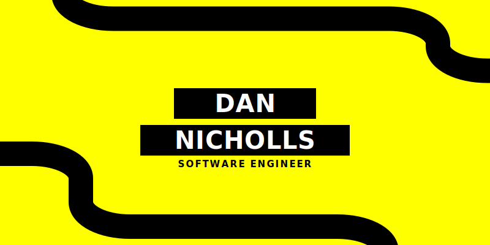

<strong>AI Software Engineer</strong> focused on computer vision, video delivery, and real-time systems.

<em>Based in Melbourne, VIC.</em>

<table>
  <tr>
    <td valign="top" width="50%">

## Focus

- Object detection and tracking (YOLO, ResNet, CNN)
- Streaming media systems (RTSP, WebRTC, DeepStream, GStreamer)
- Scalable inference and deployment (Triton, Docker, AWS/Azure)

    </td>
    <td valign="top" width="50%">

## Stack

- Languages: Go, Python, JavaScript
- Frameworks: DeepStream, GStreamer, ONNX, PyTorch
- Eventing: Kafka, Flink, RabbitMQ
- Automation: GitHub Actions, Azure Pipelines
- Deployment: Docker, AWS, Azure
- OS: Linux (Ubuntu, Arch), Nix

    </td>
  </tr>
</table>

## Contact

- Email: [dannicholls12@gmail.com](mailto:dannicholls12@gmail.com)
- GitHub: [@dan-nicholls](https://github.com/dan-nicholls)
- LinkedIn: [dannichollsdev](https://www.linkedin.com/in/dannichollsdev/)
